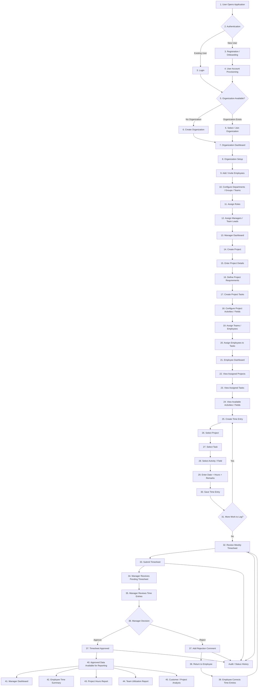

# Sify Workforce Platform Workflow

## 1. End-to-End Business Workflow



---

## 2. Application Access and Organization

The user starts by opening the application and authenticating through the configured identity and access management solution.

After authentication, the system determines whether the user is associated with an organization.

The current workflow supports:

- Existing user login
- New user registration / onboarding
- Organization creation when required
- Selecting or joining an existing organization

The exact user provisioning and organization membership process is **TBC**.

---

## 3. Organization Structure

The current organizational structure is:

```text
Organization
    ↓
Department / Group
    ↓
Team
    ↓
Employee
```

The platform should support:

- Adding or inviting employees
- Creating organizational groups
- Assigning roles
- Assigning managers / Team Leads
- Maintaining team membership

The exact distinction between Department, Group and Team is **TBC**.

---

## 4. Project Management

The project workflow is:

```text
Customer
    ↓
Project
    ↓
Task
    ↓
Activity
```

A manager or authorized user can:

1. Create a project
2. Enter project details
3. Define project requirements
4. Create project tasks
5. Configure project activities / fields
6. Assign teams and/or employees
7. Assign employees to tasks

The exact assignment relationships are **TBC**.

---

## 5. Dynamic Project Activities

Project activities are intended to be configurable rather than fixed in the database schema.

Example:

```text
Project A
    - Development
    - Testing
    - Deployment

Project B
    - Requirement Analysis
    - Design
    - Client Meeting
```

A new activity should be added as configuration/data rather than by creating a new database column or changing the database schema.

The exact ownership level of activities is **TBC**.

---

## 6. Employee Work and Time Entry

Employees can view their assigned work and record time against valid work items.

The current time-entry flow is:

```text
Project
    ↓
Task
    ↓
Activity / Field
    ↓
Date
    ↓
Hours
    ↓
Remarks
    ↓
Save Time Entry
```

Employees can create multiple time entries during the applicable timesheet period.

The system should prevent employees from recording time against work they are not permitted to access.

---

## 7. Timesheet Submission

The current workflow uses a weekly timesheet.

The flow is:

```text
Time Entries
    ↓
Review Weekly Timesheet
    ↓
Submit Timesheet
```

After submission, the timesheet becomes available to the appropriate manager or approver.

The exact timesheet period and generation mechanism are **TBC**.

---

## 8. Timesheet Approval

The current approval workflow is:

```text
Employee
    ↓
Submit Timesheet
    ↓
Manager Review
    ↓
Approve / Reject
```

### Approval

```text
Manager Approves
    ↓
Timesheet Approved
    ↓
Approved Data Available for Reporting
```

### Rejection

```text
Manager Rejects
    ↓
Rejection Comment
    ↓
Return to Employee
    ↓
Employee Corrects Time Entries
    ↓
Review Timesheet
    ↓
Resubmit
```

The exact approval hierarchy and rejection scope are **TBC**.

---

## 9. Reporting

Approved time data can be used for reporting.

The current report areas are:

- Manager Dashboard
- Employee Time Summary
- Project Hours Report
- Team Utilization Report
- Customer / Project Analysis

Detailed formulas, filters and report definitions are **TBC**.

---

## 10. Audit and Status History

Important timesheet workflow changes should be traceable.

Current events include:

- Submission
- Approval
- Rejection
- Resubmission

The detailed audit scope and retention requirements are **TBC**.

---

## 11. Core Business Structures

### Organization Structure

```text
Organization
    ↓
Department / Group
    ↓
Team
    ↓
Employee
```

### Work Structure

```text
Customer
    ↓
Project
    ↓
Task
    ↓
Activity
```

### Time Tracking Structure

```text
Employee
    ↓
Time Entry
    ↓
Timesheet
    ↓
Manager Review
    ↓
Approval / Rejection
```

---

## 12. Key Workflow Decisions Pending Confirmation

| ID | Topic | Current Understanding | Status |
|---|---|---|---|
| WF-01 | Employee-Team relationship | One or multiple teams | TBC |
| WF-02 | Employee-Project relationship | Assignment required | TBC |
| WF-03 | Activity ownership | Configurable activity; ownership level not finalized | TBC |
| WF-04 | Task requirement | Task is part of current time-entry flow | TBC |
| WF-05 | Activity requirement | Activity is part of current time-entry flow | TBC |
| WF-06 | Timesheet period | Weekly in current workflow | TBC |
| WF-07 | Approval hierarchy | Manager approval shown | TBC |
| WF-08 | Rejection scope | Timesheet-level rejection shown | TBC |

---

## 13. Current Status

**Status:** Initial Design

This workflow represents the current understanding of the platform and is intended for review with the Manager / Team Lead.

**Next Step:** Confirm the open business decisions before finalizing the database model and API contracts.