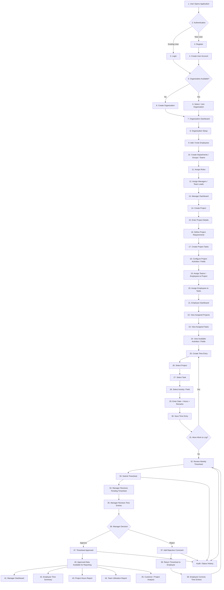

# Sify Workforce Platform Workflow

## 1. End-to-End Business Workflow



### Initial Implementation Note

The diagram above represents the intended end-to-end business flow. However, to keep the initial V1 release practical, the following implementation decisions have been made:

- **Create Departments / Groups / Teams:** 
  *Initial implementation:* Only `Team` is implemented. The hierarchy is simply Organization → Team → Employee. No Department or Group entities will be created initially.
- **Assign Teams / Employees to Project:**
  *Initial implementation:* We use direct Employee ↔ Project assignment. Team ↔ Project assignment is not implemented initially to avoid complex overlapping access rules.
- **Assign Employees to Tasks:**
  *Initial implementation:* No direct Task ↔ Employee assignment. Any employee assigned to the project can work on its active project tasks.

---

## 2. Application Access and Organization

The user starts by opening the application and authenticating. After authentication, the system determines whether the user is associated with an organization.

The workflow supports:
- Existing user login
- New user registration / onboarding
- Organization creation when required
- Selecting or joining an existing organization

---

## 3. Organization Structure

The confirmed organizational structure for the initial implementation is flattened:

```text
Organization
    ↓
Team
    ↓
Employee
```

The platform supports:
- Adding or inviting employees
- Creating teams
- Assigning employees to exactly one team
- Assigning roles (ADMIN, MANAGER, EMPLOYEE)
- Assigning a single manager / Team Lead per team

---

## 4. Project Management

The confirmed project workflow structure is:

```text
Customer
    ↓
Project
    ↓
Task
    ↓
Activity
```

A manager or authorized user can:
1. Create a project and link it to a customer
2. Enter project details
3. Create project tasks
4. Configure project-specific activities
5. Assign employees directly to projects (`ProjectAssignment`)

*Note: Tasks and Teams are not assigned to employees in the initial version.*

---

## 5. Dynamic Project Activities

Project activities are configurable per project, meaning they are owned by the Project. 

Example:
```text
Project A
    - Development
    - Testing
    - Deployment

Project B
    - Requirement Analysis
    - Design
    - Client Meeting
```

A new activity is added as a data record linked to the project, preventing the need for database schema changes or new hard-coded fields.

---

## 6. Employee Work and Time Entry

Employees view their assigned projects and record time against valid work items.

The time-entry flow is:
```text
Project
    ↓
Task
    ↓
Activity
    ↓
Date
    ↓
Hours
    ↓
Remarks
    ↓
Save Time Entry
```

**Implementation Rules:**
- Both `Task` and `Activity` are mandatory for all time entries.
- The system prevents employees from recording time against projects they are not assigned to.

---

## 7. Timesheet Submission

The workflow uses a fixed weekly timesheet (Monday to Sunday).

The flow is:
```text
Time Entries
    ↓
Review Weekly Timesheet
    ↓
Submit Timesheet
```

**Timesheet Generation:** When an employee creates the first time entry for a week, a "Draft" timesheet is created automatically if one does not already exist.

---

## 8. Timesheet Approval

The approval hierarchy uses a single-level manager approval based on the employee's assigned Team's manager.

### Approval
```text
Manager Approves
    ↓
Timesheet Approved
    ↓
Approved Data Available for Reporting
```
*Note: Approved timesheets become read-only and cannot be edited by anyone.*

### Rejection
```text
Manager Rejects
    ↓
Rejection Comment Required
    ↓
Return Timesheet to Employee (Status: Rejected)
    ↓
Employee Corrects Time Entries
    ↓
Resubmit Timesheet
```
*Note: Rejection occurs at the entire Timesheet level, not individual time entries.*

---

## 9. Reporting

Approved time data is available for reporting:
- Manager Dashboard
- Employee Time Summary
- Project Hours Report
- Team Utilization Report
- Customer / Project Analysis

---

## 10. Audit and Status History

Important timesheet workflow changes are traceable to preserve historical context. 
Business entities (Employees, Projects, Tasks, Activities) use soft-deactivation (`isActive: false`) rather than hard deletion to ensure historical time entries and timesheets remain valid for audits.

---

## 11. Core Business Structures

### Organization Structure
```text
Organization
    ↓
Team
    ↓
Employee
```

### Work Structure
```text
Customer
    ↓
Project
    ↓
Task
    ↓
Activity
```

### Time Tracking Structure
```text
Employee
    ↓
Project Assignment
    ↓
Time Entry
    ↓
Timesheet
    ↓
Manager Review
    ↓
Approval / Rejection
```

---

## 12. Current Status

**Status:** Confirmed & Implementation Ready

This workflow aligns with the agreed implementation decisions and acts as the source of truth for V1 development.